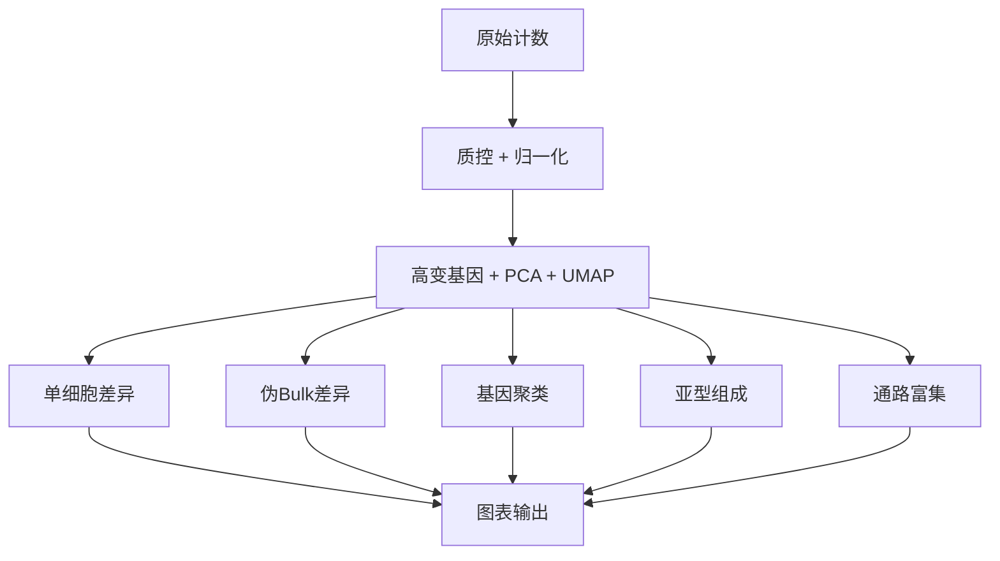

# scTIME

[](https://www.python.org/)
[](LICENSE)

一套面向单细胞 RNA-seq 时间序列实验的模块化、断点续跑分析框架。



## 为什么选择 scTIME

与将每个时间点独立处理的常规流程不同，scTIME 为时间序列分析专门设计：计算基因跨时间的表达轨迹、识别相邻时间点间的转换节点、量化细胞类型脆弱性变化，并在每个时间阶段进行通路富集。

| 能力 | 实现 |
|---|---|
| 差异表达 | 单细胞级 Wilcoxon（灵敏度）+ 伪Bulk级 t 检验与 BH 校正（统计严谨性） |
| 时间序列聚类 | 全基因组表达轨迹 k 均值聚类；转换基因鉴定 |
| 细胞类型脆弱性 | 基于倍变化的分类（脆弱 / 稳定 / 韧性），结合卡方检验 |
| 通路富集 | 每个时间点独立 Enrichr GO Biological Process 富集 |
| 断点续跑 | 每个步骤保存中间 `.h5ad` 文件，重复运行自动跳过 |
| 内存高效 | 分块 CSV 读取、自动稀疏矩阵转换、float32 存储 |
| 图表 | Nature 风格 PNG + PDF 图表，附带对应 CSV 源数据 |

## 快速开始

```bash
pip install pandas numpy scipy anndata scanpy statsmodels gseapy scikit-learn seaborn matplotlib tqdm

python scripts/pipeline.py          # 合并 + 质控 + 归一化 + HVG + PCA + UMAP
python scripts/deg_analysis.py      # 单细胞差异 + 伪Bulk构建
python scripts/pb_deg.py            # 伪Bulk t检验差异
python scripts/trajectory.py        # 基因共表达聚类 + 转换分析
python scripts/subtype_analysis.py  # 细胞类型组成 + 脆弱性评分
python scripts/pathway_analysis.py  # 时间点 GO 富集
python scripts/make_figures.py      # 出版图表
```

所有脚本均包含 `if __name__ == "__main__"` 入口点，数据路径和质控阈值通过类属性配置。

## 参数配置

编辑各脚本中的类属性：

```python
# pipeline.py -- 质控阈值
MIN_GENES = 200          # 每细胞最小基因数
MAX_GENES = 6000         # 每细胞最大基因数
MIN_COUNTS = 500         # 最小 UMI 计数
MAX_MITO_PCT = 20.0      # 最大线粒体比例

# trajectory.py -- 聚类
n_clusters = 6           # 基因轨迹聚类数

# pb_deg.py -- 统计检验
# 使用 Welch t 检验与 Benjamini-Hochberg 校正
```

## 许可证

MIT
